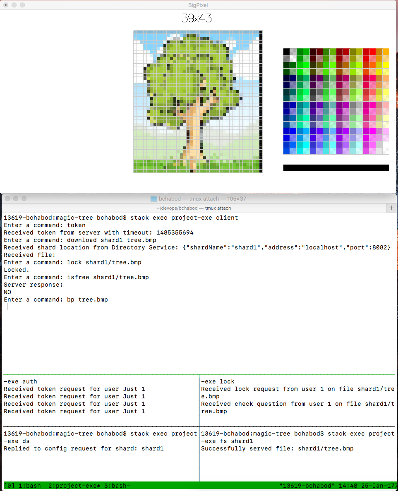

# :deciduous_tree: Magic Tree DFS

Magic Tree is the distributed file system I wrote in Haskell as a final project for CS4032. My student information is:

|Name             |Student ID|Status|
|-----------------|:--------:|:--------:|
|Benoit Chabod    |16336617  |Erasmus  |

Here's the procedure to install and run this project on your PC:

```bash
git clone https://github.com/bchabod/magic-tree
cd magic-tree
stack build
stack exec project-exe [ROLE]
```

Magic Tree isn't finished yet. It was supposed to be a **distributed graphics assets editor**, enabling a designer team to work collaboratively on an anime or video game project. This is why I've integrated BigPixel (a simple bitmap editor in Haskell) inside the project, and if I have enough time I will modify it to use the client proxy and to edit distant bitmaps in parallel. Here's a preview:



Please see the documentation below to find out the different roles and how to use the application.

## :evergreen_tree: Usage

To use magic tree, you will have to spawn the various nodes that compose the distributed file system. I'm planning on automating this in the future, using deploy scripts and Dockerfiles. For now, everything runs in local and here are the different attributes for [ROLE]:

* **auth** will spawn the Authentication Server, running on port 8080
* **ds** will spawn the Directory Service, on port 8081
* **fs** followed by a shard name will spawn a File Server on the port indicated in 
[config.json](config.json). A shard is a subdirectory owned by a specific file server.
* **lock** will spawn the Lock Service on port 8084

You can also use the [ROLE] attribute to run the client, using the keyword **client**.
And although it's not linked to the DFS yet, you can use the **bp** keyword followed by a file name to test the bitmap editor. The client supports the following commands for the moment:

```bash
"exit | quit" : Close the client session
"token" : Ask for a token from the Auth service
"download shardName fileName" : Download a file
"upload shardName fileName content" : Upload a file
"lock filePath" : Lock a file to prevent other clients from using it
"release filePath" : Unlock a previously locked file
"isfree filePath" : Ask to the Lock service if a file is locked or not
```

## :palm_tree: Implementation

First of all, the Authentication Server runs using a procedure similar to the one given in the subject, using *AES128* to encrypt and decrypt data. The authentication node holds a shared secret for all the servers and the clients secrets (derived from their password). When a client wants to speak with a server, he requests a token from the AS, which is encrypted with his secret and contains a ticket encrypted with the server secret. Both the token and the ticket contain a session key. When the client decrypts the token (he can do so only if he's not a fraud), he reads the session key and can now send the data he wanted to any server, encrypted with this session key. When the server receives the data, it gets the session key from the ticket, decrypts the action and act accordingly. There's a *TTL* attribute so that tokens eventually expire.

Secondly, the Directory Service and the File Servers were implemented using a directory-based segmentation as described in the subject. In the basic config given here, there's one FS handling "shard1/" and one FS handling "shard2/". When the client wants to access a file, it first sends a request to the DS asking for the IP/port to contact for this shard.

Finally, the Lock Service is an explicit API for now. It's the responsability of the client to respect the lock attribute, and to set it and release it appropriatly when dealing with critical files. The LS uses [locks.json](files/locks.json) to store its data.

The communication is mainly done using JSON files sent as OctetStream through Servant calls. The Aeson package is used to decode and encode JSON, while Cipher provides methods to encrypt and decrypt in *AES128*.

### TODO
* Replication, probably with a simple backup shard for each shard handled by another FS. When the client can't reach the default location given by the DS, it should try to reach the failover one. 
* Caching should be done at the client level. We should write the changes in the bitmap on a local file and we should propagate these changes to the FS on a regular basis but not constantly.
* Transactions could be implemented easily, using the scheme described in the subject.
